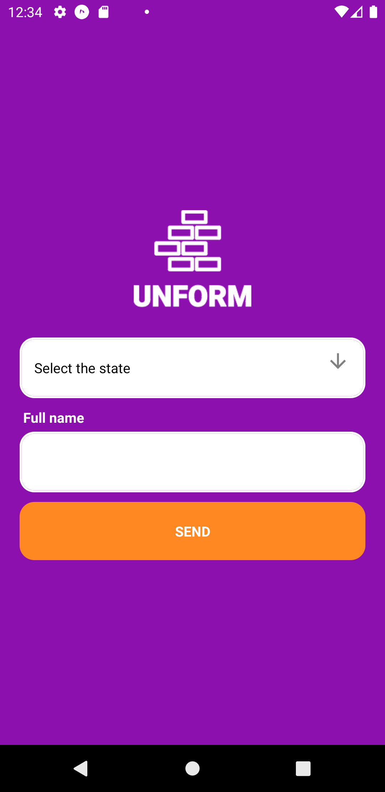
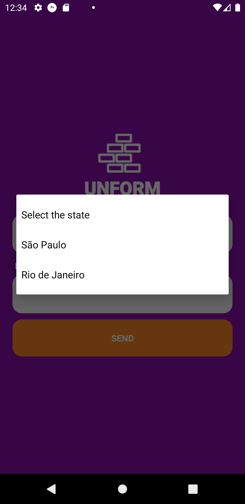
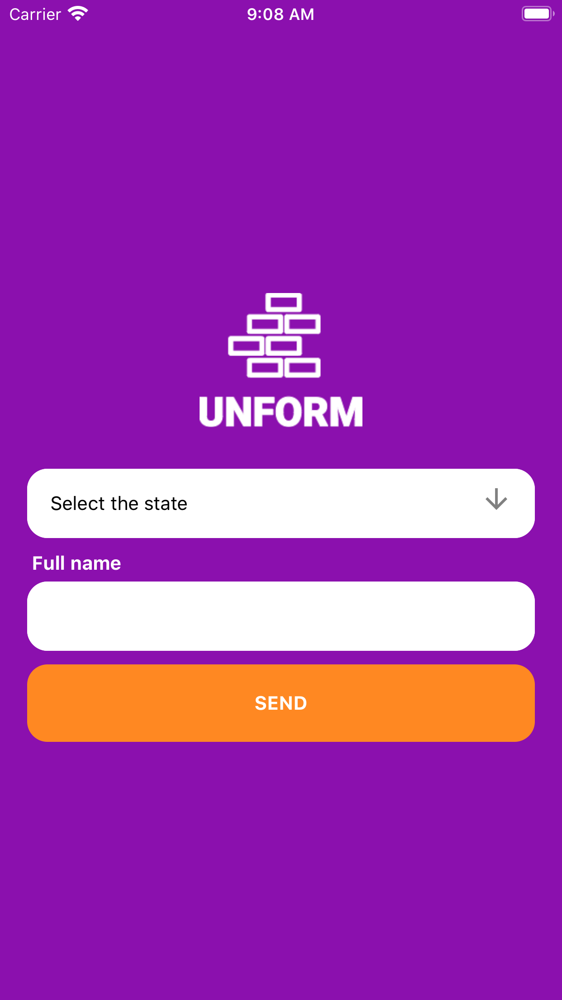
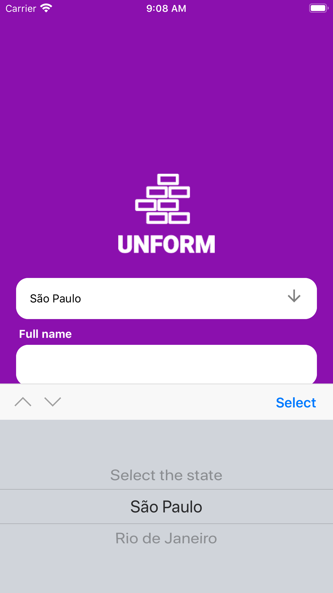

<h1 align="center">Picker Unform</h1>

<p align="center">Projeto criado com objetivo de implementar um picker junto ao Unform, pois até então na documentação do Unform não possui exemplos relacionados.
</p>

<p align="center"><a href="https://github.com/Rocketseat/unform/issues/286">Issue: 286</a></p>


<p align="center">
 <a href="https://www.linkedin.com/in/daviddossantoscruz/">
    
  </a>


  

</p>


<h4 align="center"> React Picker, concluído 🚀 </h4>


### 🔨 Features

-  [x] Integração Picker junto ao biblioteca de formulário <a href="unform.dev" >Unform<a>
-  [x] Intregração Android e iOS 


| Android Example 	| Android Example 	|
|-------------	|-------------	|
|  |  | 

| iOS Example 	| iOS Example 	|
|-------------	|-------------	|
|   |  |


### 🚀  Como executar o projeto

### Pré-requisitos

Clone e execute a aplicação, você precisa Git, Node.js + Yarn e Expo, instalado no seu computador.

### 🎲 Rodando projeto

```bash
# Clone o repositório
$ git clone https://github.com/daviddossantos/picker-unform

# Entre no repositório
$ cd picker-unform

# Instale as depedencias
$ yarn install

# Inicie o projeto
$ expo start
```

### 💚 Tecnologias

As seguintes ferramentas foram usadas na construção do projeto:

- [Expo](https://expo.io/)
- [Node.js](https://nodejs.org/en/)
- [React Native](https://reactnative.dev/)
- [Yarn](https://yarnpkg.com/)
- [JavaScript](https://www.javascript.com/)

### 📝 Licença

Esse projeto está sob a licença MIT. Veja o arquivo [LICENSE](LICENSE.md) para mais detalhes.

---

Feito com ♥ by David Cruz :wave: [Entre em contato!](https://www.linkedin.com/in/daviddossantoscruz/)